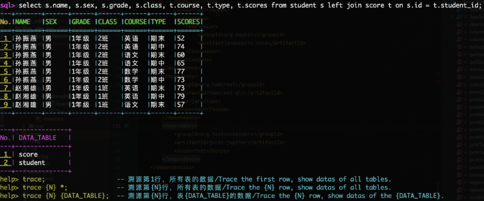
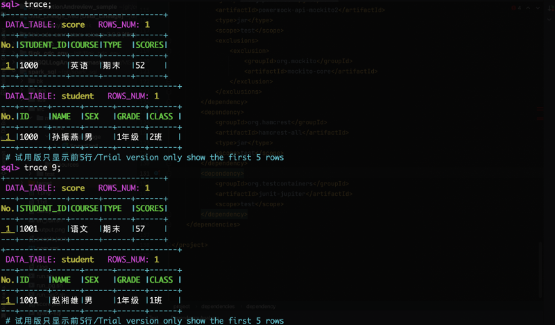

# Spark SQL Tracer
Imagine a tool that can peer into the outcomes of Spark SQL executions and trace the origins of each data row—this is Spark SQL Tracer. It not only tells you where the data comes from but also shows you how it's derived.

website：http://sqllineage.com/trace

## Quick Start

### Installation Guide
1. **Check JDK**: Open the terminal and type `java -version` to see if JDK is ready for action. We need version 1.8 or higher.
2. **Check SPARK**: Make sure Spark is installed, with 3.x or above being the best match. Don't forget to set the `SPARK_HOME` environment variable.
3. **Download the Software**: Visit the [GitHub repository](https://github.com/sqllineages/spark_sql_tracer).
4. **Unpack the Tool**: Use `tar -xzvf spark_tracer.gz` to decompress the tool.
5. **Start the Tool**: Navigate to the `spark_tracer` directory and run `./run.sh` to launch the data tracing tool.

### Usage

1. The tool's usage is consistent with the Spark-SQL Shell, where you input SQL to get data query results.
2. Unlike Spark-SQL, it shows which original data tables are referenced alongside the results.
3. You can follow the tool's prompts to input `trace line_number table_name;` to display the specified original data.

## Common Tracing Methods

1. Organize the logic of SQL and sort out the scope and relationships of referenced data.
2. Select characteristic fields in the result set to locate original data in the raw data.
3. Gradually investigate and reproduce the calculation process to verify the issues.

## Solve Pain Points

When facing the challenges of data tracing, traditional methods might be helpless. But don't worry, Spark SQL Tracer can help you solve:

1. Original data is updated, and the result scene cannot be reproduced?
2. Original data has no primary key, and the result has no characteristic fields?
3. Result data is encrypted, and reverse calculation is impossible?
4. Summary data comes from the aggregation of a large amount of original data?
5. The association between tables is weak, depending on the fields calculated after?
6. Result data comes from complex field parsing, even intertwined with intermediate results?

Use Spark SQL Tracer to make data tracing simple and intuitive.
