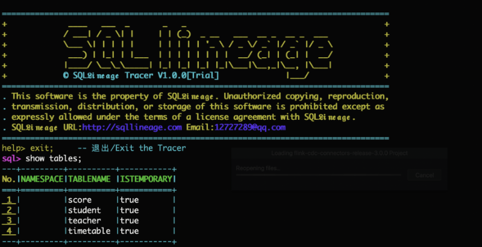

# Spark SQL Tracer 
有这样一个能够透视Spark SQL执行结果，找出每一行数据源头的工具，这就是Spark SQL Tracer。它不仅告诉你数据从何而来，还展示重现给你。

website：http://sqllineage.com/trace

## 快速上手

### 安装指南
1. **检查JDK**：打开终端，输入`java -version`，看看JDK是否已经准备好，我们需要的是1.8或更高版本
2. **检查SPARK**：确认Spark已经安装，3.x或以上版本是最佳搭档。别忘了设置环境变量`SPARK_HOME`
3. **下载软件**：前往[GitHub仓库](https://github.com/sqllineages/spark_sql_tracer)
4. **解压工具**：用`tar -xzvf spark_tracer.gz`解压缩工具软件。
5. **启动软件**：进入`spark_tracer`目录，执行`./run.sh`，开启数据溯源工具。

### 使用方法

1. 工具的使用方法和Spark-SQL Shell使用方法一致，输入SQL获取数据查询结果。
2. 与Spark-SQL不同的是，返回结果的同时会显示，结果引用了哪些原始数据表
3. 可根据工具的提示输入 trace 行号 表名; 显示指定的原始数据。

## 常见的溯源方式

1. 梳理SQL的逻辑,整理引用数据的范围和关联关系
2. 在结果集里挑选特征的字段去原始数据中定位原始数据
3. 逐步排查和重现计算过程求证问题

## 解决痛点

面对数据溯源的重重难关，传统方法可能束手无策。但别担心，Spark SQL Tracer可以帮你解决：

1. 原始数据更新，结果现场无法重现？
2. 原始数据无主键，结果无特征字段？
3. 结果数据加密，逆向运算无门？
4. 汇总数据源自大量原始数据的聚合？
5. 表间关联薄弱，依赖计算后的字段？
6. 结果数据源自复杂字段解析，甚至与中间结果交织？

使用Spark SQL Tracer，让数据溯源变得简单、直观。
